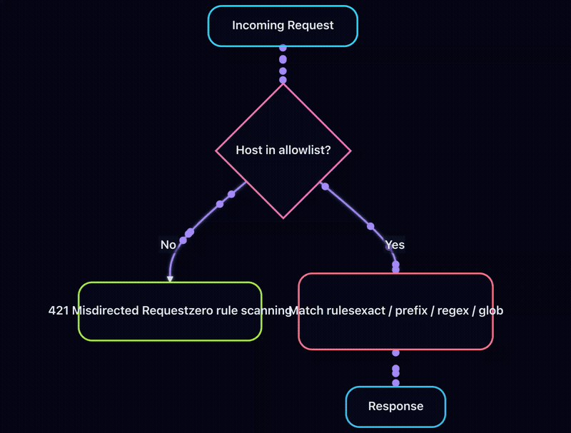

# The Redirector

A high-performance, enterprise-grade URL redirect and response service built in Go.

[](https://golang.org)
[](LICENSE)

## Overview

The Redirector handles URL redirects and custom responses at massive scale with sub-millisecond latency. Unlike general-purpose reverse proxies, it's purpose-built for redirect workloads with features designed for enterprise environments.

Built by a DevOps/Platform Engineer with an emphasis on **decentralized configuration ownership**. Teams that own redirects can manage their own rules — via GitHub repos, S3 buckets, or any supported source — without depending on a DevOps or Platform Engineering team to make changes on their behalf. The syncer merges multiple team configs with conflict detection and priority-based resolution. For organizations that prefer centralized management, the same architecture works with a single config source.

### Key Features

- **Blazing Fast**: Built on fasthttp with radix tree routing for < 1ms p99 latency
- **Flexible Matching**: Exact paths, prefixes, regex with capture groups, and glob wildcards
- **Host Allowlist**: O(1) early rejection of unknown hosts for DDoS mitigation
- **Any HTTP Response**: Not just redirects - return 404, 403, 503, or any status with custom bodies
- **Header Injection**: Add custom headers to any response
- **Multi-File Config**: Split rules across multiple YAML files for team organization
- **Live Monitoring**: htop-style TUI for real-time request debugging
- **Config Linting**: Detect duplicates, conflicts, and performance issues before deployment
- **Decoupled Architecture**: Separate redirector-sync service for complex config management
- **Observable**: Stats endpoints, structured logging with rotation

## Components

| Binary | Description |
|--------|-------------|
| `redirector` | Main redirect server |
| `redirector-sync` | Config sync + lint |
| `redirector-tui` | Live monitoring dashboard |

---

## Quick Start

### Build

```bash
# Build all binaries
go build ./...

# Or build individually
go build -o bin/redirector ./cmd/redirector
go build -o bin/redirector-sync ./cmd/redirector-sync
go build -o bin/redirector-tui ./cmd/redirector-tui
```

### Run

```bash
# Start the redirector
./bin/redirector -config config.yaml

# In another terminal, start the TUI monitor
./bin/redirector-tui -url http://localhost:8081

# Trigger immediate config reload
./bin/redirector sync
```

### Test

```bash
# Test a redirect
curl -I http://localhost:8080/old-home
# HTTP/1.1 301 Moved Permanently
# Location: https://example.com/
# X-Redirected-By: the-redirector
# X-Rule-ID: homepage-redirect
```

### CLI Commands

```bash
redirector                 # Start the server
redirector sync            # Trigger config reload
redirector version         # Show version
redirector help            # Show help
```

---

## Configuration

Basic structure of a redirector config file:

```yaml
version: "1.0"

server:
  port: 8080              # Redirect traffic port
  management_port: 8081   # Stats/health API port
  read_timeout: 5s
  write_timeout: 5s

defaults:
  status_code: 301
  preserve_query: true
  headers:
    X-Powered-By: "the-redirector"

stats:
  enabled: true
  buffer_size: 1000
  sampling_rate: 1.0

rules:
  - id: my-rule
    match:
      type: exact         # exact, prefix, regex, or glob
      path: /old-path
    redirect:
      to: https://example.com/new-path
      status: 301
```

For a complete reference of every configuration field (server, auth, tracing, rate limiting, logging, and all syncer source types), see **[docs/CONFIGURATION.md](docs/CONFIGURATION.md)**.

---

## Rule Types

The redirector supports four match types — **exact**, **prefix**, **regex** (with capture groups), and **glob** (with `*`, `**`, `?` wildcards). Rules can return any HTTP status code, not just redirects.

Short-form rules are also supported for managing large rule sets:

```yaml
rules:
  - /old -> https://new.com
  - /blog/* -> https://blog.example.com/ [301, preserve_path]
  - ^/product/(\d+)$ -> https://shop.example.com/item/$1 [302]
```

For full details, examples, CSV format, and include files, see **[docs/RULE_TYPES.md](docs/RULE_TYPES.md)**.

---

## Host Allowlist (DDoS Mitigation)

When rules specify `match.host`, the redirector automatically builds an O(1) host allowlist. Requests for unknown hosts are rejected immediately with **421 Misdirected Request** — before any rule scanning.



The allowlist is derived automatically from `match.host` fields across all rules. If any rule omits `match.host`, the allowlist is disabled (that rule is a catch-all).

For full details, see the Host Allowlist section in **[docs/RULE_TYPES.md](docs/RULE_TYPES.md)**.

---

## Management API

The management API runs on a separate port (default: 8081) with health checks, stats, config inspection, and Prometheus metrics.

```bash
curl http://localhost:8081/health        # Liveness probe
curl http://localhost:8081/ready         # Readiness probe
curl http://localhost:8081/stats         # Summary statistics
curl http://localhost:8081/api/v1/config # Config info
curl -X POST http://localhost:8081/api/v1/reload  # Trigger reload
```

For all endpoints, Prometheus metrics, and authentication details, see **[docs/MANAGEMENT_API.md](docs/MANAGEMENT_API.md)**.

---

## redirector-sync

Separate service for pulling configuration from multiple sources (S3, GitHub, GitLab, Azure Blob, GCS, Consul, etcd, HTTP, AWS Parameter Store, AWS Secrets Manager) with failover, multi-team merging, and integrated config linting.

```bash
./redirector-sync --config syncer.yaml           # Continuous sync
./redirector-sync --config syncer.yaml --one-shot # Fetch once and exit
./redirector-sync --lint --lint-config config.yaml # Validate config
```

For full setup, source types, conflict resolution, and linting details, see **[docs/SYNCER.md](docs/SYNCER.md)**.

---

## redirector-tui

Live monitoring dashboard with htop-style interface.


*Generated with [VHS](https://github.com/charmbracelet/vhs). Regenerate: `vhs docs/tui-demo.tape`*

```bash
./redirector-tui --url http://localhost:8081
```

Features: real-time request stream, sorting, filtering, latency histogram, and multi-team config conflict view.

For keyboard shortcuts and full details, see **[docs/TUI.md](docs/TUI.md)**.

---

## Deployment

Docker, Kubernetes, and performance tuning guides are available in **[docs/DEPLOYMENT.md](docs/DEPLOYMENT.md)**.

---

## Documentation

| Document | Description |
|----------|-------------|
| [Configuration Reference](docs/CONFIGURATION.md) | Every config field for redirector, syncer, and CLI flags |
| [Rule Types](docs/RULE_TYPES.md) | Match types, non-redirect responses, host routing, compact formats |
| [Management API](docs/MANAGEMENT_API.md) | Health, stats, config, and Prometheus endpoints |
| [Syncer](docs/SYNCER.md) | Multi-source config sync, linting, conflict resolution |
| [TUI](docs/TUI.md) | Live monitoring dashboard |
| [Deployment](docs/DEPLOYMENT.md) | Docker, Kubernetes, performance tuning |
| [Architecture](docs/ARCHITECTURE.md) | Internal design and data flow |
| [Features](docs/FEATURES.md) | Feature overview and design decisions |
| [GitHub Integration](docs/GITHUB_INTEGRATION.md) | GitHub App and PAT setup |
| [Load Testing](docs/LOAD_TESTING.md) | Load testing methodology |
| [Performance](docs/PERFORMANCE.md) | Benchmark results |

---

## Project Structure

```
the-redirector/
├── cmd/
│   ├── redirector/          # Main server
│   ├── redirector-sync/     # Config sync + lint service
│   └── redirector-tui/      # Live monitoring TUI
├── internal/
│   ├── config/              # YAML parsing, validation
│   ├── router/              # Radix tree + regex routing
│   ├── server/              # fasthttp server
│   ├── stats/               # Ring buffer stats
│   ├── lint/                # Linting rules
│   ├── logging/             # Log rotation
│   └── providers/           # Config sources (file, http, github, gitlab, s3, etc.)
├── pkg/redirect/            # Public types
├── config.yaml              # Sample configuration
├── syncer.yaml              # Sample syncer configuration
└── docs/                    # Additional documentation
```

---

## Development

```bash
# Run unit tests
go test ./...

# Run tests with coverage
go test -cover ./...

# Run integration tests (requires Docker)
make integration-test

# Build all binaries
go build ./...

# Format code
go fmt ./...

# Vet code
go vet ./...
```

### Integration Testing

Integration tests run against real services using free emulators:

| Service | Emulator |
|---------|----------|
| AWS (S3, SSM, Secrets Manager) | LocalStack |
| Azure Blob Storage | Azurite |
| GCP Cloud Storage | fake-gcs-server |
| Consul | Official Docker image |
| etcd | Official Docker image |

```bash
make integration-up      # Start test infrastructure
make integration-test    # Run integration tests
make integration-down    # Stop test infrastructure
```

---

## Roadmap

See [IMPLEMENTATION_PLAN.md](IMPLEMENTATION_PLAN.md) for detailed status.

**Completed:**
- Prometheus metrics endpoint
- Hot reload with fsnotify
- Full AWS S3/Parameter Store/Secrets Manager integration
- Azure Blob, GCP Cloud Storage, Consul, etcd integrations
- GitHub integration (PAT + GitHub App JWT auth, release/branch/tag strategies, tag pattern matching)
- GitLab integration (PAT, OAuth2 with auto token refresh, release/branch/tag strategies, tag pattern matching)
- HTTP/HTTPS endpoint provider (bearer/basic auth, ETag caching, custom headers)
- OpenTelemetry tracing
- Load testing infrastructure
- redirector-sync (formerly config-syncer) refactored to use provider Registry (no duplicate source implementations)
- Comprehensive test coverage across all providers (unit + integration)

**Upcoming:**
- Multi-tenancy support

---

## License

MIT License - see [LICENSE](LICENSE) for details.

---

## Acknowledgments

- [fasthttp](https://github.com/valyala/fasthttp) - High-performance HTTP
- [zerolog](https://github.com/rs/zerolog) - Zero-allocation logging
- [lumberjack](https://github.com/natefinch/lumberjack) - Log rotation
- [bubbletea](https://github.com/charmbracelet/bubbletea) - TUI framework
- [lipgloss](https://github.com/charmbracelet/lipgloss) - TUI styling
