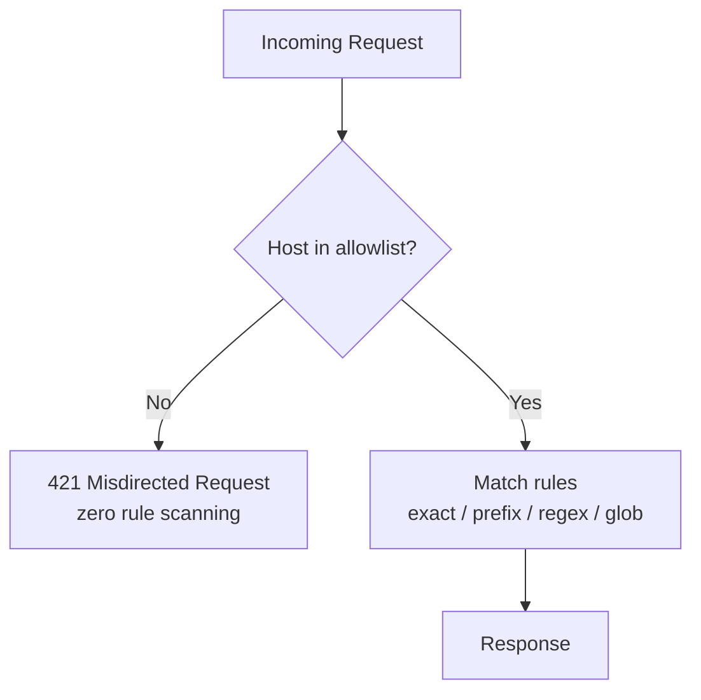

# Rule Types

The Redirector supports four match types for routing incoming requests: exact, prefix, regex, and glob. Rules can return redirects (3xx) or any HTTP response status.

## Exact Match

Matches a specific path exactly.

```yaml
- id: homepage-redirect
  match:
    type: exact
    path: /old-home
  redirect:
    to: https://example.com/
    status: 301
```

## Prefix Match

Matches any path starting with the prefix. Use `preserve_path` to carry over the suffix.

```yaml
# /blog/hello-world -> https://blog.example.com/hello-world
- id: blog-redirect
  match:
    type: prefix
    path: /blog/
  redirect:
    to: https://blog.example.com/
    preserve_path: true
    status: 301
```

## Regex Match

Full regex support with capture groups (`$1`, `$2`, etc.).

```yaml
# /product/12345 -> https://shop.example.com/item/12345
- id: product-redirect
  match:
    type: regex
    pattern: ^/product/(\d+)$
  redirect:
    to: https://shop.example.com/item/$1
    status: 302

# Multiple captures
# /category/electronics/item/42 -> https://shop.example.com/electronics/42
- id: category-item
  match:
    type: regex
    pattern: ^/category/([^/]+)/item/(\d+)$
  redirect:
    to: https://shop.example.com/$1/$2
```

## Glob Match

User-friendly wildcard patterns.

| Pattern | Matches |
|---------|---------|
| `*` | Single path segment |
| `**` | Any depth (zero or more segments) |
| `?` | Single character |

```yaml
# /docs/v1/guide, /docs/v2/guide, etc.
- id: docs-version
  match:
    type: glob
    pattern: /docs/*/guide
  redirect:
    to: https://docs.example.com/
    preserve_path: true

# /legacy/anything/at/any/depth
- id: legacy-catch-all
  match:
    type: glob
    pattern: /legacy/**
  redirect:
    to: https://new.example.com/
    preserve_path: true
```

---

## Non-Redirect Responses

Return any HTTP status code with optional body — not just redirects.

### Block Requests (404/403)

```yaml
# Block WordPress admin probes
- id: block-wp-admin
  match:
    type: prefix
    path: /wp-admin
  redirect:
    status: 404
    body: "Not Found"

# Block common attack paths
- id: block-bots
  match:
    type: regex
    pattern: ^/(\.env|\.git|phpinfo|wp-login)
  redirect:
    status: 403
    body: "Forbidden"
    headers:
      X-Blocked: "true"
```

### Maintenance Mode (503)

```yaml
- id: maintenance
  match:
    type: glob
    pattern: /api/**
  redirect:
    status: 503
    body: "Service temporarily unavailable"
    headers:
      Retry-After: "3600"
  priority: 1000  # High priority overrides other rules
```

### Gone (410)

```yaml
- id: discontinued-product
  match:
    type: exact
    path: /old-product
  redirect:
    status: 410
    body: "This product has been discontinued"
```

---

## Host-Based Routing

Match requests by hostname for domain migrations.

```yaml
- id: old-domain-redirect
  match:
    type: prefix
    host: old.example.com
    path: /
  redirect:
    to: https://new.example.com/
    preserve_path: true
```

### Host Allowlist (DDoS Mitigation)

When rules specify `match.host`, the redirector automatically builds an O(1) host allowlist at startup and on every config reload. Requests whose `Host` header doesn't match any configured host are rejected immediately with **421 Misdirected Request** — before any rule scanning takes place. This is a defensive measure that short-circuits the entire router for traffic aimed at unknown domains, which is common during volumetric DDoS attacks.

The allowlist is derived from `match.host` fields across all rules. No manual configuration is needed.



**Port stripping**: The `Host` header may include a port (e.g., `example.com:8080`). The allowlist strips the port before lookup, so a rule with `host: example.com` matches requests to `example.com`, `example.com:8080`, `example.com:443`, etc.

**Prometheus metric**: Rejected requests increment the `redirector_host_rejected_total` counter, visible at the `/metrics` endpoint. Use this to monitor attack volume without flooding your application logs (rejections are logged at `debug` level only).

#### Catch-All Rules Disable the Allowlist

If **any** rule omits `match.host` (i.e., it matches requests regardless of domain), the host allowlist is automatically disabled. This is because a host-less rule is a catch-all that could legitimately match any domain — rejecting hosts would break that rule's intent.

```yaml
rules:
  # This rule has a host — adds "api.example.com" to the allowlist
  - id: api-redirect
    match:
      type: prefix
      host: api.example.com
      path: /v1/
    redirect:
      to: https://api.example.com/v2/
      status: 301

  # This rule has NO host — it matches any domain
  # Its presence DISABLES the host allowlist entirely
  - id: catch-all-404
    match:
      type: prefix
      path: /wp-admin
    redirect:
      status: 404
      body: "Not Found"
```

In the example above, the `catch-all-404` rule has no `match.host`, so the allowlist is disabled and all hosts are accepted. If you want the allowlist active, every rule must specify a `match.host`.

**Tip**: To keep the allowlist active while still having fallback rules, add `host` to every rule — including your catch-alls:

```yaml
rules:
  # Allowlist stays active because every rule specifies a host
  - id: api-redirect
    match:
      type: prefix
      host: api.example.com
      path: /v1/
    redirect:
      to: https://api.example.com/v2/
      status: 301

  - id: block-wp-admin
    match:
      type: prefix
      host: api.example.com    # <-- explicit host keeps allowlist active
      path: /wp-admin
    redirect:
      status: 404
      body: "Not Found"
```

---

## Environment Variables

Use `${VAR}` or `${VAR:-default}` syntax in any string value.

```yaml
- id: api-gateway
  match:
    type: prefix
    path: /gateway/
  redirect:
    to: ${API_GATEWAY_URL:-https://gateway.example.com}/
    preserve_path: true
```

---

## Priority and Ordering

Rules are evaluated in this order:

1. **Priority field** (higher numbers first)
2. **Match type specificity**: exact > prefix > regex > glob
3. **Path length** (longer paths first for prefix matches)
4. **Config file order** (for same priority)

```yaml
# Fallback rule - negative priority ensures it's evaluated last
- id: fallback
  match:
    type: glob
    pattern: /**
  redirect:
    to: https://example.com/not-found
    status: 302
  priority: -100
```

---

## Multi-File Configuration

Split rules across multiple YAML files for team organization. Files are loaded alphabetically and merged.

```
config/
├── 00-defaults.yaml      # Server settings, defaults
├── 10-api-redirects.yaml # API team rules
├── 20-blog-redirects.yaml # Content team rules
└── 30-legacy.yaml        # Migration rules
```

```bash
# Load entire directory
./redirector --config ./config/
```

---

## Compact Rule Formats

For managing large rule sets (1000s of rules), use compact formats instead of verbose YAML.

### Short-Form YAML

One rule per line, inline in your config:

```yaml
rules:
  # Simple redirects
  - /old -> https://new.com
  - /about -> https://example.com/company/about

  # With status code
  - /temp-promo -> https://shop.example.com/sale [302]

  # With options
  - /blog/* -> https://blog.example.com/ [301, preserve_path]
  - /api/v1/* -> https://api.com/v2/ [307, preserve_path, preserve_query]

  # Host-based
  - old.example.com:/ -> https://new.example.com/ [preserve_path]

  # Regex (starts with ^)
  - ^/product/(\d+)$ -> https://shop.example.com/item/$1 [302]

  # Mix with full-form rules
  - id: complex-rule
    match:
      type: prefix
      path: /complex/
    redirect:
      to: https://example.com/
      headers:
        X-Custom: "value"
```

**Pattern detection is automatic:**
| Pattern | Type |
|---------|------|
| `/exact/path` | exact |
| `/prefix/` (trailing /) | prefix |
| `/glob/*` or `/**` | glob |
| `^/regex/` | regex |

### CSV Format

For bulk imports from spreadsheets or scripts:

```csv
# rules.csv - comments start with #
/old,https://new.com
/blog/*,https://blog.com/,301,preserve_path
/api/v1/*,https://api.com/v2/,307,preserve_path,preserve_query
```

Format: `origin,destination[,status][,options...]`

### Include External Files

Reference CSV or YAML files from your main config:

```yaml
# config.yaml
version: "1.0"

rules:
  - /inline-rule -> https://example.com

# Include external rule files
rules_include:
  - rules/marketing.csv      # CSV from marketing team
  - rules/legacy-urls.csv    # Bulk migration rules
  - rules/api-redirects.yaml # API team YAML rules
```

**Use case:** Each team maintains their own rules file, included into the main config.
